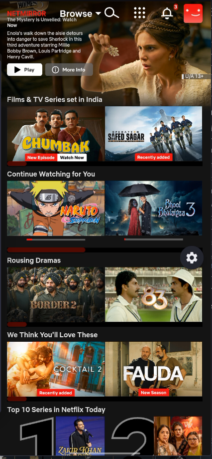
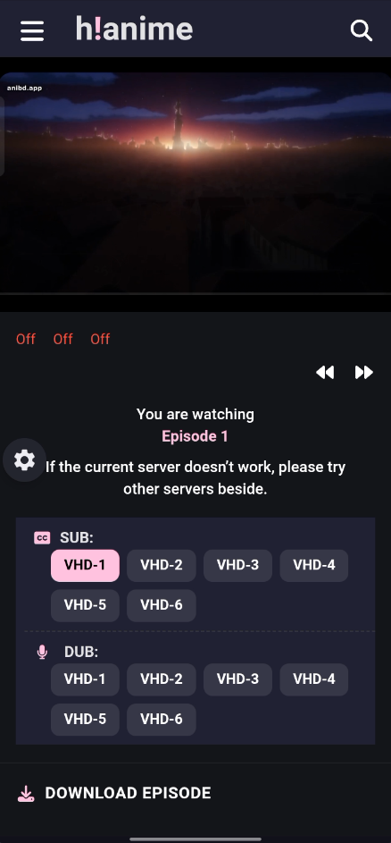
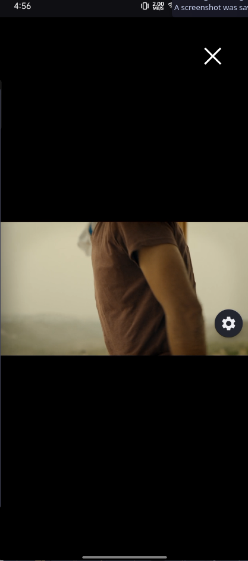

# CatFlix

CatFlix is an Android app that turns supported streaming sites into a
standalone, app-like experience. Instead of opening links in Chrome, it
embeds a Chromium WebView behind a minimal native shell with ad blocking,
sign-in handling, background playback, Picture-in-Picture, volume boosting,
and a full settings system.

Primary target: `https://net77.cc/` (NetMirror family), with trusted access
to `netmirror.gg`, `netmirror.app`, `hineanime.lol`, and `hianime.lol`.

## Screenshots

| Home catalog | Watch page | Playback |
|---|---|---|
|  |  |  |

> **Disclaimer:** CatFlix does not promote piracy or pirated content. It is
> an open-source app built around NetMirror, shared strictly for
> educational purposes only.

## Contributing

Found an issue? Please [open an issue](../../issues) with device model,
Android version, steps to reproduce, and (where relevant) a filtered logcat.
Pull requests are welcome — keep changes focused, match the existing code
style, and verify with `./gradlew :app:assembleDebug` before submitting.

## Features

### Embedded browser
- Chromium System WebView with desktop-grade settings: JavaScript, DOM
  storage, third-party cookies (required for sign-in), Safe Browsing,
  mixed-content blocking, pinch zoom, and mobile-friendly viewport handling.
- Single-app UI: no URL bar. One draggable settings button opens a bottom
  control sheet (Back / Forward / Reload / Home / Pop-out player + all
  settings). Double-press back to exit; fullscreen video is truly immersive.
- Session persistence: cookies flushed on page finish, pause, and stop;
  last visited page restores on cold start, plus a snapshot splash so
  relaunch paints instantly while fresh content loads.

### Ad blocking (uBlock-compatible, no DNS tricks)
- Network filtering from the same lists uBlock Origin ships (uAssets
  `filters`, `badware`, `privacy`, `quick-fixes`, `unbreak`, plus EasyList,
  EasyPrivacy, and Peter Lowe's), refreshed in the background with disk cache.
- Cosmetic element hiding from `##` rules (player-safe selectors excluded).
- Detector neutering: anti-adblock beacons get fake-success responses
  (uBlock redirect-rule style) instead of blocks, so walls don't trigger.
- Popup/toast killer: auto-clicks close buttons and hides nag overlays,
  bottom ad banners, invisible click-capture layers, and video-smothering
  layers — with guards that never touch media-carrying subtrees.
- Site cleanup for NetMirror promo blocks (temporary-link banner, Telegram,
  footer app promos), matched by text so markup renames don't matter.
- A minimal always-on base tracker layer stays active even with blocking off.

### Google sign-in
- Sign-in stays inside the embedded WebView so the session (and its cookies)
  lives in the app and survives restarts — including all Google country
  domains (`accounts.google.*`) and a Cloudflare-challenge mobile-UA retry.
- If Google serves `Error 403: disallowed_useragent`, the app detects the
  dead page and offers an explicit system-browser fallback plus a post-login
  restart prompt. No User-Agent spoofing, no TLS bypasses, ever.

### Media: notification, lock screen, PiP
- Foreground `MediaPlaybackService` with `MediaSessionCompat`: play/pause,
  next/previous, seek, live position/duration, and artwork in the
  notification and on the lock screen.
- Detection fuses DOM polling (same-origin iframes included, Firefox-style
  eligibility, Media Session metadata) with media-traffic sniffing and
  audible-output signals, so iframe-embedded players are tracked too.
- Picture-in-Picture: auto-enter on backgrounding during playback (API 31+)
  with explicit fallback below, manual pop-out action, live-aspect refresh,
  play/pause window actions, and video-focus (scroll into view, hide page
  chrome) while in PiP.

### Volume boost (OpenEQ technique)
- Native `LoudnessEnhancer` on the global output mix — works on any page
  audio with no page cooperation (in-page WebAudio routing breaks on
  cross-origin streams). 100–5000% seekbar with device-safe gain clamping.

### Smart HTTP cache (`net/`)
- TTL by content kind, ETag/Last-Modified conditional revalidation, 304
  handling, in-flight request deduplication, persistent LRU disk store, and
  stale-on-error fallback. Backs filter-list updates and artwork fetching.

### Settings (all persisted)
Block ads & trackers, Auto PiP, Background playback, Dark mode, Swipe zoom,
Desktop mode, Text size (50–200% slider), Volume boost (100–5000% slider),
Downloads preferences, player orientation, button position. Overflow and
redirect handling: trusted sites open directly; anything else asks via an
"Open link?" dialog unless it follows a real tap.

## Tech stack

- Kotlin 2.2.10, AGP 9.4.1, Gradle 9.6.0, compile/target SDK 37, minSdk 26
- Jetpack Compose (BOM 2026.02.01) + Material3, SplashScreen API
- AndroidX Browser (Custom Tabs fallback), WebKit, Media, Lifecycle
- No WebView JavaScript bridge anywhere (deliberate hardening choice)

## Project structure

```
app/src/main/java/com/alex/catflix/
├── MainActivity.kt          # Compose shell, PiP, settings sheet, lifecycle
├── adblock/AdBlockEngine.kt # uBlock-compatible network + cosmetic filtering
├── audio/VolumeBooster.kt   # Global-mix loudness gain (OpenEQ technique)
├── auth/GoogleAuthHandler.kt# OAuth detection + system-browser fallback
├── media/                   # Playback service, session bus, page controller
├── net/SmartHttpCache.kt    # TTL + ETag cache with request dedup
├── settings/AppSettings.kt  # Persisted preferences
├── ui/theme/                # Brand theme (ink/paper, red accent, shapes)
└── web/                     # WebView clients, navigation policy, DOM cleaners
tools/remove_comments.py     # Encoding-safe comment-stripper dev tool
inspiration/                 # Reference checkouts (read-only research)
```

## Build

Open in Android Studio (2026.1+) and run the `app` configuration, or:

```sh
./gradlew :app:assembleDebug
```

The first launch performs one full filter-list fetch, then stays quiet for a
day thanks to the HTTP cache.

## Permissions

`INTERNET`, `ACCESS_NETWORK_STATE` (browsing), `FOREGROUND_SERVICE` +
`FOREGROUND_SERVICE_MEDIA_PLAYBACK` (background playback),
`POST_NOTIFICATIONS` (playback controls, Android 13+),
`MODIFY_AUDIO_SETTINGS` (volume boost).

## Known platform limits (honest)

- WebView cannot load browser extensions — ad blocking is rule-parity, not
  the `.crx` itself. True extension hosting would require a GeckoView
  migration.
- Cross-origin iframe internals are invisible to page scripts: detection
  there is traffic/audio-heuristic, and transport falls back to
  WebView-level pause/resume.
- Desktop User-Agents can trip Cloudflare challenges; the app retries those
  once with the mobile UA automatically.
